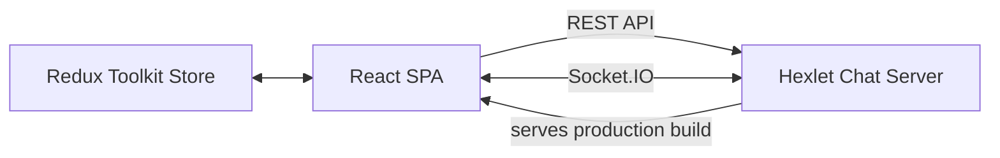

<div align="center">

# Hexlet Chat

**A real-time, Slack-inspired chat application built with React and Socket.IO.**

[Live demo](https://hexlet-chat-bjm1.onrender.com) · [Report a bug](https://github.com/onlydisco/hexlet-chat/issues)

[](https://codeclimate.com/github/onlydisco/hexlet-chat/maintainability)
[](https://hexlet-chat-bjm1.onrender.com)

</div>

## About

Hexlet Chat is a single-page real-time chat application inspired by Slack. Users can create an account, join channels, exchange messages instantly, and manage custom channels from a responsive interface.

The project was built as the final frontend project in the [Hexlet](https://hexlet.io) curriculum. It demonstrates authentication, client-side routing, normalized state management, form validation, localization, error monitoring, and real-time communication.

## Features

- User registration, sign-in, and protected routes
- Real-time messaging powered by Socket.IO
- Channel creation, renaming, deletion, and switching
- Client-side form validation with clear error feedback
- Profanity filtering for messages and channel names
- Russian localization with pluralization
- Toast notifications and Rollbar error monitoring
- Responsive UI based on React Bootstrap

## Tech stack

| Area | Technologies |
| --- | --- |
| UI | React, React Bootstrap, Sass |
| State | Redux Toolkit, React Redux |
| Forms | Formik, Yup |
| Routing | React Router |
| Real-time | Socket.IO Client |
| HTTP | Axios |
| Localization | i18next, react-i18next |
| Monitoring | Rollbar |
| Backend | `@hexlet/chat-server` |

## How it works



The React application uses REST endpoints for authentication and initial data loading. New messages and channel changes are delivered through Socket.IO and stored in normalized Redux slices.

## Getting started

### Requirements

- Node.js 16 or newer; an active LTS release is recommended
- npm
- GNU Make, or the equivalent npm commands shown below

### Installation

```bash
git clone git@github.com:onlydisco/hexlet-chat.git
cd hexlet-chat
make install
```

Without Make:

```bash
npm ci
```

The root installation automatically installs the frontend dependencies.

### Development

Start the backend and the React development server together:

```bash
make start
```

The frontend is available at `http://localhost:3000`; API requests are proxied to the chat server on port `5001`.

### Production build

```bash
npm run build
npm start
```

The production server serves the generated files from `frontend/build` and exposes the REST and Socket.IO endpoints on the same origin.

## Project structure

```text
.
├── frontend/
│   ├── public/
│   └── src/
│       ├── assets/       # Global styles
│       ├── components/   # UI, forms, and modals
│       ├── contexts/     # Authentication and API contexts
│       ├── hooks/        # Context hooks
│       ├── locales/      # Translation resources
│       ├── pages/        # Route-level components
│       └── slices/       # Redux Toolkit state
├── Makefile
└── package.json          # Server and repository scripts
```

## Environment variables

| Variable | Required | Description |
| --- | --- | --- |
| `REACT_APP_ROLLBAR_TOKEN` | No | Client access token used to report frontend errors to Rollbar |

Create `frontend/.env.local` for local values. Environment files are ignored by Git and should never contain credentials committed to the repository.

## Deployment

The application is designed to run as a single Node.js web service: the server hosts the production frontend, REST API, and Socket.IO connection on the same domain. The current deployment is hosted on [Render](https://hexlet-chat-bjm1.onrender.com).

## Author

[Sergey Mukhin](https://github.com/onlydisco)
